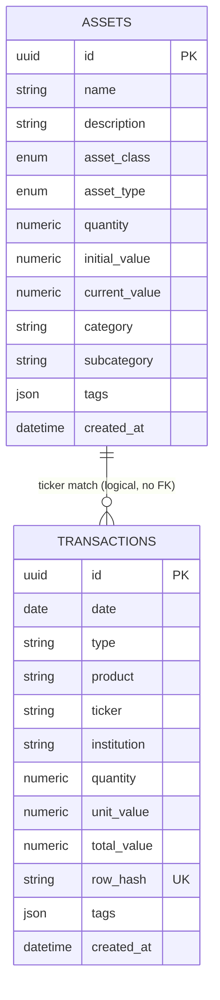

# feat: Add transactions command with CRUD and XLSX import

## Overview

Add a `transaction` CLI command group to the bed portfolio management tool. It provides standard CRUD subcommands (`create`, `edit`, `delete`, `list`) plus an `import` subcommand that bulk-imports transactions from B3's "Extrato de Movimentação" XLSX export. The bare `transaction` command (no subcommand) acts as `list`.

Transactions are denormalized historical records — no foreign key to Asset. Tags are inferred from existing assets during import.

## Problem Statement / Motivation

The portfolio currently tracks assets and their current state but has no transaction history. To analyze performance, tax obligations, dividends received, and cost basis, the system needs a complete transaction ledger. B3 provides XLSX exports with ~2300+ rows of historical data that must be importable in bulk.

## Proposed Solution

Follow the existing 4-layer pattern exactly: Model → Schema → Service → Command.

### Transaction Model

```python
# bed/models/transaction.py
class Transaction(Base):
    __tablename__ = "transactions"

    id: Mapped[uuid.UUID] = mapped_column(Uuid, primary_key=True, default=uuid.uuid4)
    date: Mapped[date] = mapped_column(Date, nullable=False)
    type: Mapped[str] = mapped_column(String(100), nullable=False)
    product: Mapped[str] = mapped_column(String(500), nullable=False)
    ticker: Mapped[str | None] = mapped_column(String(50), nullable=True)
    institution: Mapped[str] = mapped_column(String(100), nullable=False)
    quantity: Mapped[float] = mapped_column(Numeric(precision=18, scale=8), nullable=False, default=0)
    unit_value: Mapped[float] = mapped_column(Numeric(precision=18, scale=8), nullable=False, default=0)
    total_value: Mapped[float] = mapped_column(Numeric(precision=18, scale=2), nullable=False, default=0)
    tags: Mapped[list] = mapped_column(JSON, default=list)
    created_at: Mapped[str] = mapped_column(DateTime, server_default=func.now())
```

Key design decisions:
- **`ticker` is nullable** — treasury bonds like "Tesouro Selic 2026" have no ticker
- **`total_value` is stored as-is from the file** — the `unit_value * quantity` formula is documentation, not enforcement, since many rows have `"-"` for one or both values
- **`total_value` sign** — negative for debits (Debito), positive for credits (Credito), as determined by the `Entrada/Saída` column
- **No FK to Asset** — transactions are standalone historical records; importing should work even for products not yet tracked as assets

### XLSX Import Logic

The XLSX from B3 has these columns (with data mapping):

| XLSX Column | Transaction Attribute | Mapping |
|---|---|---|
| `Entrada/Saída` | `total_value` sign | `"Credito"` → positive, `"Debito"` → negative |
| `Data` | `date` | Parse `DD/MM/YYYY` string to `date` |
| `Movimentação` | `type` | Store as-is, normalize accents (`Transferencia` → `Transferência`) |
| `Produto` | `product`, `ticker` | Strip whitespace. Extract ticker (text before `" - "`) or `None` for treasury bonds |
| `Instituição` | `institution` | Map to short kebab-case via lookup table |
| `Quantidade` | `quantity` | `"-"` or `""` → `0` |
| `Preço unitário` | `unit_value` | `"-"` → `0` |
| `Valor da Operação` | `total_value` | `"-"` → `0`, then apply sign from `Entrada/Saída` |

**Ticker extraction rules:**
- Standard stocks/funds: `"CSAN3 - COSAN SA"` → `"CSAN3"` (text before first `" - "`, stripped)
- Treasury bonds: `"Tesouro Selic 2026"` → `None` (no `" - "` separator, starts with "Tesouro")
- CDB products: `"CDB - CDB321KRR3K - OMNI..."` → `None` (starts with "CDB")
- Everything else with `" - "`: take first segment as ticker

**Institution mapping (constant dict):**

```python
INSTITUTION_MAP = {
    "INTER DISTRIBUIDORA DE TITULOS E VALORES MOBILIARIOS LTDA": "inter",
    "INTER DTVM LTDA": "inter",
    "BANCO BTG PACTUAL S/A": "btg-pactual",
}
```

Fallback for unknown institutions: slugify the full name (lowercase, spaces/special chars → hyphens).

**Tag inference during import:**
1. Before importing, load all existing assets from the database
2. Build a map of `ticker → tags` from assets (matching by asset name containing the ticker)
3. For each imported row, look up tags by ticker
4. If no matching asset found, tags default to `[]`

**Duplicate handling:**
- Compute a hash of `(date, type, product, institution, quantity, unit_value, total_value)` for each row
- Before inserting, check if a transaction with the same hash already exists
- Skip duplicates and report count at the end
- Store the hash as a column (`row_hash`) with a unique constraint for fast lookup

Add `row_hash` to the model:

```python
row_hash: Mapped[str | None] = mapped_column(String(64), nullable=True, unique=True)
```

### CLI Commands

```
bed transaction          → list (default)
bed transaction list     → list with filters
bed transaction create   → create single transaction
bed transaction edit     → edit by identifier
bed transaction delete   → delete by identifier
bed transaction import   → bulk import from XLSX
```

**Aliases:**
- `bed t` → `bed transaction`
- `bed tt` → `bed transaction list`
- CRUD: `e`, `c`, `d`, `l`, plus `i` for import

**List filters (important — the dataset is 2304+ rows):**
- `--ticker` / `-k`: filter by ticker
- `--type` / `-m`: filter by movimentação type
- `--institution` / `-i`: filter by institution
- `--from` / `-f`: filter by start date (YYYY-MM-DD)
- `--to` / `-o`: filter by end date (YYYY-MM-DD)
- `--limit` / `-n`: max rows (default: 50)
- `--all`: show all (no limit)

Sorted by date descending (most recent first).

**Import options:**
- `FILE` argument (required): path to XLSX file
- `--dry-run`: preview what would be imported without committing
- `--sheet`: sheet name (default: "Movimentação")

## Technical Considerations

- **New dependency**: `openpyxl` (already added to project via `uv add`)
- **Accent normalization**: `Transferencia` → `Transferência` during import (use `unicodedata` or simple dict)
- **Product whitespace**: strip trailing whitespace from product names before storage
- **Batch size**: commit in batches of 500 rows for performance with 2300+ rows
- **Date parsing**: the XLSX stores dates as strings in `DD/MM/YYYY`; parse with `datetime.strptime`

## Acceptance Criteria

### Core CRUD
- [ ] `bed transaction create` creates a transaction with all required fields
- [ ] `bed transaction list` displays transactions in tabulate format
- [ ] `bed transaction list` defaults to 50 most recent, sorted by date desc
- [ ] `bed transaction list` supports `--ticker`, `--type`, `--institution`, `--from`, `--to`, `--limit`, `--all` filters
- [ ] `bed transaction edit <id>` updates specified fields
- [ ] `bed transaction delete <id>` deletes with confirmation
- [ ] `bed transaction` (no subcommand) invokes list
- [ ] Identifier resolution works by UUID, row number, or ticker+date

### Import
- [ ] `bed transaction import <file.xlsx>` imports all rows from the XLSX
- [ ] Ticker extracted correctly: stocks get ticker, treasury bonds get `None`, CDBs get `None`
- [ ] Institutions mapped to short kebab-case names
- [ ] `Entrada/Saída` correctly sets sign of `total_value`
- [ ] `"-"` values in numeric columns parsed as `0`
- [ ] Product names stripped of trailing whitespace
- [ ] Accent variants normalized (`Transferencia` → `Transferência`)
- [ ] Tags inferred from existing assets by ticker match
- [ ] Duplicate rows detected by hash and skipped on re-import
- [ ] Import summary printed: "X imported, Y skipped (duplicates)"
- [ ] `--dry-run` shows preview without committing

### Registration
- [ ] Command registered in `cli.py` with alias `t`
- [ ] CRUD aliases: `e`, `c`, `d`, `l`, plus `i` for import
- [ ] `tt` double-letter shortcut for list
- [ ] Model imported in `bed/models/__init__.py`
- [ ] `resolve_transaction_id()` added to `bed/commands/utils.py`

### Tests
- [ ] Service tests: CRUD operations for transactions (`tests/test_transactions_service.py`)
- [ ] Command tests: CLI integration tests (`tests/test_transactions_command.py`)
- [ ] Import tests: parsing logic (ticker extraction, institution mapping, sign, dash handling)

## ERD



## MVP

### bed/models/transaction.py

```python
import uuid
from datetime import date as date_type

from sqlalchemy import Date, JSON, Numeric, String, func
from sqlalchemy.orm import Mapped, mapped_column
from sqlalchemy.types import Uuid, DateTime

from bed.database import Base


class Transaction(Base):
    __tablename__ = "transactions"

    id: Mapped[uuid.UUID] = mapped_column(Uuid, primary_key=True, default=uuid.uuid4)
    date: Mapped[date_type] = mapped_column(Date, nullable=False)
    type: Mapped[str] = mapped_column(String(100), nullable=False)
    product: Mapped[str] = mapped_column(String(500), nullable=False)
    ticker: Mapped[str | None] = mapped_column(String(50), nullable=True)
    institution: Mapped[str] = mapped_column(String(100), nullable=False)
    quantity: Mapped[float] = mapped_column(Numeric(precision=18, scale=8), nullable=False, default=0)
    unit_value: Mapped[float] = mapped_column(Numeric(precision=18, scale=8), nullable=False, default=0)
    total_value: Mapped[float] = mapped_column(Numeric(precision=18, scale=2), nullable=False, default=0)
    row_hash: Mapped[str | None] = mapped_column(String(64), nullable=True, unique=True)
    tags: Mapped[list] = mapped_column(JSON, default=list)
    created_at: Mapped[str] = mapped_column(DateTime, server_default=func.now())
```

### bed/schemas/transaction.py

```python
import uuid
from datetime import date, datetime

from pydantic import BaseModel, ConfigDict


class TransactionCreate(BaseModel):
    date: date
    type: str
    product: str
    ticker: str | None = None
    institution: str
    quantity: float = 0
    unit_value: float = 0
    total_value: float = 0
    row_hash: str | None = None
    tags: list[str] = []


class TransactionRead(BaseModel):
    model_config = ConfigDict(from_attributes=True)

    id: uuid.UUID
    date: date
    type: str
    product: str
    ticker: str | None
    institution: str
    quantity: float
    unit_value: float
    total_value: float
    row_hash: str | None
    tags: list[str]
    created_at: datetime


class TransactionUpdate(BaseModel):
    date: date | None = None
    type: str | None = None
    product: str | None = None
    ticker: str | None = None
    institution: str | None = None
    quantity: float | None = None
    unit_value: float | None = None
    total_value: float | None = None
    tags: list[str] | None = None
```

### bed/services/transactions.py

```python
import hashlib
import uuid
from datetime import date

from sqlalchemy import select, desc
from sqlalchemy.ext.asyncio import AsyncSession

from bed.models.transaction import Transaction
from bed.schemas.transaction import TransactionCreate, TransactionUpdate


async def list_transactions(
    db: AsyncSession,
    ticker: str | None = None,
    type_filter: str | None = None,
    institution: str | None = None,
    date_from: date | None = None,
    date_to: date | None = None,
    limit: int | None = 50,
) -> list[Transaction]:
    query = select(Transaction).order_by(desc(Transaction.date), desc(Transaction.created_at))
    if ticker:
        query = query.where(Transaction.ticker == ticker)
    if type_filter:
        query = query.where(Transaction.type == type_filter)
    if institution:
        query = query.where(Transaction.institution == institution)
    if date_from:
        query = query.where(Transaction.date >= date_from)
    if date_to:
        query = query.where(Transaction.date <= date_to)
    if limit:
        query = query.limit(limit)
    result = await db.execute(query)
    return list(result.scalars().all())


async def get_transaction(db: AsyncSession, txn_id: uuid.UUID) -> Transaction | None:
    return await db.get(Transaction, txn_id)


async def create_transaction(db: AsyncSession, data: TransactionCreate) -> Transaction:
    txn = Transaction(**data.model_dump())
    db.add(txn)
    await db.commit()
    await db.refresh(txn)
    return txn


async def update_transaction(db: AsyncSession, txn_id: uuid.UUID, data: TransactionUpdate) -> Transaction | None:
    txn = await db.get(Transaction, txn_id)
    if not txn:
        return None
    for key, value in data.model_dump(exclude_none=True).items():
        setattr(txn, key, value)
    await db.commit()
    await db.refresh(txn)
    return txn


async def delete_transaction(db: AsyncSession, txn_id: uuid.UUID) -> bool:
    txn = await db.get(Transaction, txn_id)
    if not txn:
        return False
    await db.delete(txn)
    await db.commit()
    return True


async def bulk_create_transactions(db: AsyncSession, items: list[TransactionCreate]) -> tuple[int, int]:
    """Returns (imported_count, skipped_count)."""
    existing_hashes = set()
    result = await db.execute(select(Transaction.row_hash).where(Transaction.row_hash.isnot(None)))
    existing_hashes = {row[0] for row in result.all()}

    imported = 0
    skipped = 0
    for data in items:
        if data.row_hash and data.row_hash in existing_hashes:
            skipped += 1
            continue
        txn = Transaction(**data.model_dump())
        db.add(txn)
        if data.row_hash:
            existing_hashes.add(data.row_hash)
        imported += 1

    await db.commit()
    return imported, skipped


def compute_row_hash(
    date_val: date,
    type_val: str,
    product: str,
    institution: str,
    quantity: float,
    unit_value: float,
    total_value: float,
) -> str:
    key = f"{date_val}|{type_val}|{product}|{institution}|{quantity}|{unit_value}|{total_value}"
    return hashlib.sha256(key.encode()).hexdigest()
```

### bed/services/xlsx_import.py

```python
import re
from datetime import datetime

import openpyxl

INSTITUTION_MAP = {
    "INTER DISTRIBUIDORA DE TITULOS E VALORES MOBILIARIOS LTDA": "inter",
    "INTER DTVM LTDA": "inter",
    "BANCO BTG PACTUAL S/A": "btg-pactual",
}

ACCENT_NORMALIZATION = {
    "Transferencia": "Transferência",
}

TREASURY_PREFIXES = ("Tesouro ",)
NO_TICKER_PREFIXES = ("Tesouro ", "CDB ")


def parse_xlsx(file_path: str, sheet_name: str = "Movimentação") -> list[dict]:
    """Parse B3 movimentação XLSX into a list of raw transaction dicts."""
    wb = openpyxl.load_workbook(file_path, read_only=True)
    ws = wb[sheet_name]

    rows = []
    for row_idx, row in enumerate(ws.iter_rows(min_row=2, values_only=True), start=2):
        if not row[0]:
            continue

        entrada_saida, data, movimentacao, produto, instituicao, quantidade, preco, valor = row

        rows.append({
            "entrada_saida": str(entrada_saida).strip(),
            "date": parse_date(data),
            "type": normalize_type(str(movimentacao).strip()),
            "product": str(produto).strip(),
            "ticker": extract_ticker(str(produto).strip()),
            "institution": map_institution(str(instituicao).strip()),
            "quantity": parse_numeric(quantidade),
            "unit_value": parse_numeric(preco),
            "total_value": parse_numeric(valor),
        })

    wb.close()
    return rows


def parse_date(value) -> "date":
    if isinstance(value, datetime):
        return value.date()
    return datetime.strptime(str(value).strip(), "%d/%m/%Y").date()


def parse_numeric(value) -> float:
    if value is None or str(value).strip() in ("-", ""):
        return 0.0
    return float(value)


def extract_ticker(product: str) -> str | None:
    for prefix in NO_TICKER_PREFIXES:
        if product.startswith(prefix):
            return None
    if " - " in product:
        return product.split(" - ")[0].strip()
    return None


def map_institution(name: str) -> str:
    if name in INSTITUTION_MAP:
        return INSTITUTION_MAP[name]
    # Fallback: slugify
    slug = re.sub(r"[^a-z0-9]+", "-", name.lower()).strip("-")
    return slug


def normalize_type(movimentacao: str) -> str:
    return ACCENT_NORMALIZATION.get(movimentacao, movimentacao)


def apply_sign(total_value: float, entrada_saida: str) -> float:
    if entrada_saida == "Debito":
        return -abs(total_value)
    return abs(total_value)
```

### bed/commands/transactions.py

```python
import click
from datetime import date, datetime
from tabulate import tabulate

from bed.commands.db import get_session, run_async
from bed.commands.utils import resolve_transaction_id
from bed.schemas.transaction import TransactionCreate, TransactionUpdate
from bed.services import transactions as service
from bed.services.transactions import compute_row_hash
from bed.services.xlsx_import import parse_xlsx, apply_sign


@click.group("transaction", invoke_without_command=True)
@click.pass_context
def transaction(ctx):
    """Manage transactions."""
    if ctx.invoked_subcommand is None:
        ctx.invoke(list_transactions)


@transaction.command("list")
@click.option("--ticker", "-k", default=None, help="Filter by ticker")
@click.option("--type", "-m", "type_filter", default=None, help="Filter by movimentação type")
@click.option("--institution", "-i", default=None, help="Filter by institution")
@click.option("--from", "-f", "date_from", default=None, help="Start date (YYYY-MM-DD)")
@click.option("--to", "-o", "date_to", default=None, help="End date (YYYY-MM-DD)")
@click.option("--limit", "-n", type=int, default=50, help="Max rows (default: 50)")
@click.option("--all", "show_all", is_flag=True, default=False, help="Show all (no limit)")
def list_transactions(ticker, type_filter, institution, date_from, date_to, limit, show_all):
    """List transactions."""

    async def _run():
        async with get_session() as db:
            df = datetime.strptime(date_from, "%Y-%m-%d").date() if date_from else None
            dt = datetime.strptime(date_to, "%Y-%m-%d").date() if date_to else None
            return await service.list_transactions(
                db,
                ticker=ticker,
                type_filter=type_filter,
                institution=institution,
                date_from=df,
                date_to=dt,
                limit=None if show_all else limit,
            )

    items = run_async(_run())
    if not items:
        click.echo("no transactions found.")
        return

    table = []
    for i, t in enumerate(items, 1):
        table.append([
            i,
            str(t.date),
            t.type,
            t.ticker or "",
            t.product[:40],
            t.institution,
            f"{t.quantity:.4f}",
            f"{t.unit_value:.2f}",
            f"{t.total_value:.2f}",
            ", ".join(t.tags) if t.tags else "",
        ])

    headers = ["#", "date", "type", "ticker", "product", "inst", "qty", "unit", "total", "tags"]
    colalign = ("right", "left", "left", "left", "left", "left", "right", "right", "right", "left")
    click.echo(tabulate(table, headers=headers, tablefmt="simple", colalign=colalign))


@transaction.command("create")
@click.option("--date", "-d", "txn_date", required=True, help="Transaction date (YYYY-MM-DD)")
@click.option("--type", "-m", "txn_type", required=True, help="Transaction type")
@click.option("--product", "-p", required=True, help="Product name")
@click.option("--ticker", "-k", default=None, help="Ticker symbol")
@click.option("--institution", "-i", required=True, help="Institution (short name)")
@click.option("--quantity", "-q", type=float, default=0, help="Quantity")
@click.option("--unit-value", "-u", type=float, default=0, help="Unit value")
@click.option("--total-value", "-v", type=float, default=0, help="Total value (negative for debit)")
@click.option("--tags", "-t", default=None, help="Comma-separated tags")
def create_transaction(txn_date, txn_type, product, ticker, institution, quantity, unit_value, total_value, tags):
    """Create a new transaction."""

    async def _run():
        async with get_session() as db:
            data = TransactionCreate(
                date=datetime.strptime(txn_date, "%Y-%m-%d").date(),
                type=txn_type,
                product=product,
                ticker=ticker,
                institution=institution,
                quantity=quantity,
                unit_value=unit_value,
                total_value=total_value,
                tags=[t.strip() for t in tags.split(",")] if tags else [],
            )
            result = await service.create_transaction(db, data)
            click.echo(f"transaction created ({result.date} {result.type} {result.product}).")

    run_async(_run())


@transaction.command("edit")
@click.argument("identifier")
@click.option("--date", "-d", "txn_date", default=None, help="Transaction date (YYYY-MM-DD)")
@click.option("--type", "-m", "txn_type", default=None, help="Transaction type")
@click.option("--product", "-p", default=None, help="Product name")
@click.option("--ticker", "-k", default=None, help="Ticker symbol")
@click.option("--institution", "-i", default=None, help="Institution")
@click.option("--quantity", "-q", type=float, default=None, help="Quantity")
@click.option("--unit-value", "-u", type=float, default=None, help="Unit value")
@click.option("--total-value", "-v", type=float, default=None, help="Total value")
@click.option("--tags", "-t", default=None, help="Comma-separated tags")
def edit_transaction(identifier, txn_date, txn_type, product, ticker, institution, quantity, unit_value, total_value, tags):
    """Edit an existing transaction."""

    async def _run():
        async with get_session() as db:
            txn_id = await resolve_transaction_id(db, identifier)
            if not txn_id:
                click.echo(f"transaction '{identifier}' not found.")
                return

            data = TransactionUpdate(
                date=datetime.strptime(txn_date, "%Y-%m-%d").date() if txn_date else None,
                type=txn_type,
                product=product,
                ticker=ticker,
                institution=institution,
                quantity=quantity,
                unit_value=unit_value,
                total_value=total_value,
                tags=[t.strip() for t in tags.split(",")] if tags else None,
            )
            result = await service.update_transaction(db, txn_id, data)
            if result:
                click.echo(f"transaction updated.")
            else:
                click.echo(f"transaction '{identifier}' not found.")

    run_async(_run())


@transaction.command("delete")
@click.argument("identifier")
@click.confirmation_option(prompt="Are you sure you want to delete this transaction?")
def delete_transaction(identifier):
    """Delete a transaction."""

    async def _run():
        async with get_session() as db:
            txn_id = await resolve_transaction_id(db, identifier)
            if not txn_id:
                click.echo(f"transaction '{identifier}' not found.")
                return
            if await service.delete_transaction(db, txn_id):
                click.echo("transaction deleted.")
            else:
                click.echo(f"transaction '{identifier}' not found.")

    run_async(_run())


@transaction.command("import")
@click.argument("file", type=click.Path(exists=True))
@click.option("--sheet", default="Movimentação", help="Sheet name")
@click.option("--dry-run", is_flag=True, default=False, help="Preview without importing")
def import_transactions(file, sheet, dry_run):
    """Import transactions from B3 XLSX export."""

    async def _run():
        async with get_session() as db:
            # Parse XLSX
            click.echo(f"parsing {file}...")
            raw_rows = parse_xlsx(file, sheet_name=sheet)
            click.echo(f"found {len(raw_rows)} rows.")

            # Load asset tags for inference
            from bed.services.assets import list_assets
            assets = await list_assets(db)
            ticker_tags = {}
            for asset in assets:
                # Try to extract ticker from asset name
                if " - " in asset.name:
                    asset_ticker = asset.name.split(" - ")[0].strip()
                else:
                    asset_ticker = asset.name
                if asset.tags:
                    ticker_tags[asset_ticker] = list(asset.tags)

            # Build TransactionCreate objects
            items = []
            for row in raw_rows:
                total = apply_sign(row["total_value"], row["entrada_saida"])
                tags = ticker_tags.get(row["ticker"], [])
                row_hash = compute_row_hash(
                    row["date"], row["type"], row["product"],
                    row["institution"], row["quantity"], row["unit_value"], total,
                )
                items.append(TransactionCreate(
                    date=row["date"],
                    type=row["type"],
                    product=row["product"],
                    ticker=row["ticker"],
                    institution=row["institution"],
                    quantity=row["quantity"],
                    unit_value=row["unit_value"],
                    total_value=total,
                    row_hash=row_hash,
                    tags=tags,
                ))

            if dry_run:
                click.echo(f"[dry-run] would import {len(items)} transactions.")
                # Show first 10
                for item in items[:10]:
                    click.echo(f"  {item.date} {item.type:30s} {item.ticker or '':10s} {item.total_value:>12.2f}")
                if len(items) > 10:
                    click.echo(f"  ... and {len(items) - 10} more")
                return

            imported, skipped = await service.bulk_create_transactions(db, items)
            click.echo(f"{imported} imported, {skipped} skipped (duplicates).")

    run_async(_run())
```

### bed/commands/utils.py (addition)

```python
async def resolve_transaction_id(db: AsyncSession, identifier: str) -> uuid.UUID | None:
    from bed.models.transaction import Transaction

    try:
        return uuid.UUID(identifier)
    except ValueError:
        pass

    try:
        idx = int(identifier)
        from bed.services.transactions import list_transactions
        txns = await list_transactions(db, limit=None)
        if 1 <= idx <= len(txns):
            return txns[idx - 1].id
        return None
    except ValueError:
        pass

    return None
```

### bed/cli.py (additions)

```python
from bed.commands.transactions import transaction

cli.add_command(transaction)

# Add CRUD + import aliases
_add_subcommand_aliases(transaction, {"e": "edit", "c": "create", "d": "delete", "l": "list", "i": "import"})

# Single-letter group alias
_add_visible_alias(cli, transaction, "t", "transaction")

# Double-letter list shortcut
cli.add_command(_list_alias(transaction.commands["list"], "t list", "transactions"), name="tt")
```

### bed/models/__init__.py (addition)

```python
from bed.models.transaction import Transaction
```

## Dependencies & Risks

- **`openpyxl` dependency**: already added via `uv add openpyxl`
- **Large dataset**: 2304 rows should import in seconds with SQLite; batch commit handles this
- **Data quality**: B3 exports have inconsistent whitespace and accent variations; the import handles these
- **Re-import safety**: the `row_hash` unique constraint prevents duplicate insertion

## Sources

- B3 "Extrato de Movimentação" XLSX export (`movimentacao-2026-03-28-16-48-38.xlsx`, 2304 rows)
- B3 "Extrato de Movimentação" PDF export (`movimentacao-2026-03-28-16-47-37.pdf`, 213 pages)
- Existing codebase patterns: `bed/commands/assets.py`, `bed/services/assets.py`, `bed/models/asset.py`
